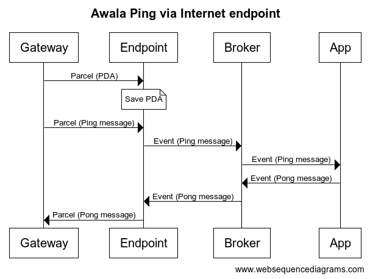

# Awala Internet Endpoint

This is a Message-Oriented Middleware (MOM) that allows server-side apps to communicate over Awala without implementing any of the networking or cryptography from the Awala protocol suite.

## Components

The middleware itself is split into a [PoHTTP](https://specs.awala.network/RS-007) server and a client, which interact with the third-party app.

The following diagram illustrates how they'd interact with each other when the app implements the [Awala Ping service](https://specs.awala.network/RS-014):

### PoHTTP server

Publicly accessible from the Internet. No auth required:

- `GET /connection-params.der`: Connection params.
- `POST /`.
  1. Parse and validate parcel.
  2. Decrypt payload.
  3. Process service message:
    - If it's an Awala PDA, store it.
    - If it's a service message, send it to the broker.

Configuration:

- `INTERNET_ENDPOINT_PEER_SESSION_MAX_AGE` (optional): The number of seconds that the peers' session keys (received in the PDAs) will be valid for.

### App

The third-party app that exchanges Awala service messages with this middleware.

It MUST expose a CloudEvents server responsible for processing `incoming-service-message` events. It MUST only be accessible from a private network without auth.

It MAY also have other components that interact with the middleware, besides the CloudEvents server.

The app MUST send service messages to Awala using the `outgoing-service-message` event.

### PoHTTP client

It MUST be a CloudEvents server responsible for processing `outgoing-service-message` events. It MUST only be accessible from a private network without auth.

## Backing services

- KMS.
- MongoDB: For encryption keys.

## Events

All events must use the binary mode of CloudEvents.

### `incoming-service-message`

Emitted by the middleware.

- `specversion`: `1.0`
- `id`: The parcel id.
- `type`: `com.relaycorp.awala.endpoint-internet.incoming-service-message`
- `source`: The parcel sender's private address.
- `subject`: The parcel recipient's private address.
- `datacontenttype`: The content type of the service message.
- `data`: The service message.
- `time`: The creation time of the parcel.

### `outgoing-service-message`

Emitted by the app.

- `specversion`: `1.0`
- `id`: The parcel id.
- `type`: `com.relaycorp.awala.endpoint-internet.outgoing-service-message`
- `source`: The parcel sender's private address, or the constant `https://relaycorp.tech/awala-endpoint-internet`.
- `subject`: The parcel recipient's private address.
- `datacontenttype`: The content type of the service message.
- `data`: The service message.
- `time`: The creation time of the parcel.
- `expiry` (`Timestamp`, custom attribute): The time at which the parcel expires.

### `undelivered-service-message`

Emitted by the middleware if a parcel message couldn't be delivered to the gateway.

- `specversion`: `1.0`
- `id`: The parcel id (as specified in the original `outgoing-service-message`).
- `type`: `com.relaycorp.awala.endpoint-internet.undelivered-service-message`
- `source`: The parcel sender's private address, or the constant `https://relaycorp.tech/awala-endpoint-internet`.
- `subject`: The parcel recipient's private address.
- `datacontenttype`: `application/vnd.relaycorp.awala.undelivered-service-message`.
- `data`: A JSON problem type.
- `time`: The creation time of the parcel.

## Changes to VeraId Authority

- CloudEvents from Structured to Binary format.
- Create a third server: Another CloudEvents server.
