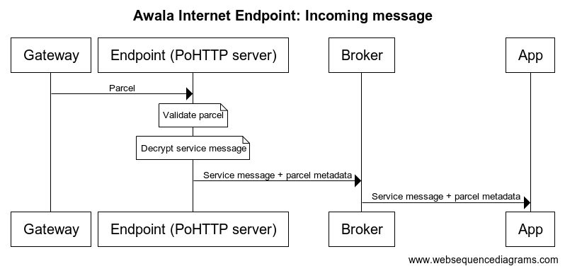
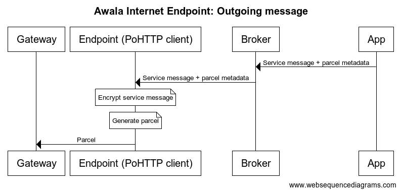
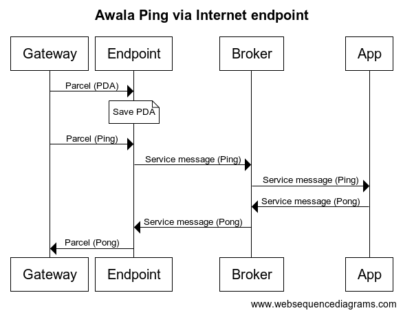

# Awala Internet Endpoint

This is a Message-Oriented Middleware (MOM) for server-side apps to communicate over [Awala](https://awala.network) without implementing any of the networking or cryptography from the protocol suite.

## Overview

As an Awala Internet Endpoint, this middleware acts as the bridge between Awala users' gateways and a server-side app, thus enabling both to exchange _parcels_. A parcel is a signed message that contains an encrypted _service message_. The service message is the actual payload (e.g., a social media post, an email).

The middleware communicates with the gateways via [PoHTTP](https://specs.awala.network/RS-007), and with the app via a [CloudEvents](https://cloudevents.io)-compliant broker (e.g., [Google Eventarc](https://cloud.google.com/eventarc/docs/overview), RabbitMQ). The app is required to comply with a [contract](./app-contract.md).

The following diagram illustrates the flow of a parcel from the gateway to the app:

On the other hand, the following diagram illustrates the flow of a parcel from the app to the gateway:

## Parcel Delivery Authorisations (PDAs)

As required by Awala, parcels bound for _private endpoints_ (e.g., Android/desktop apps) must be previously authorised by the recipient. This is done by providing the sender with a Parcel Delivery Authorisation (PDA) beforehand, which the sender should then use when generating parcels. This middleware will automatically import incoming PDAs. As of this writing, apps are not notified about PDAs.

For example, the following diagram illustrates the flow of parcels and service messages (as CloudEvents) in an app implementing the [Awala Ping service](https://specs.awala.network/RS-014):

## Architecture

As shown above, the middleware itself is split into a [PoHTTP](https://specs.awala.network/RS-007) server and a client:

- The PoHTTP server must be accessible from the Internet. It is responsible for receiving parcels from the gateways, and passing on the encapsulated service messages to the app via a broker.
- PoHTTP client must not be accessible from the Internet. It is responsible for receiving service messages from the app via a broker, and passing on the service messages encapsulated in parcels to the gateways.

The middleware requires the following backing services:

- [**MongoDB**](https://www.mongodb.com) 6 or newer.
- A **Key Management Service (KMS)** supported by [`@relaycorp/webcrypto-kms`](https://www.npmjs.com/package/@relaycorp/webcrypto-kms).
